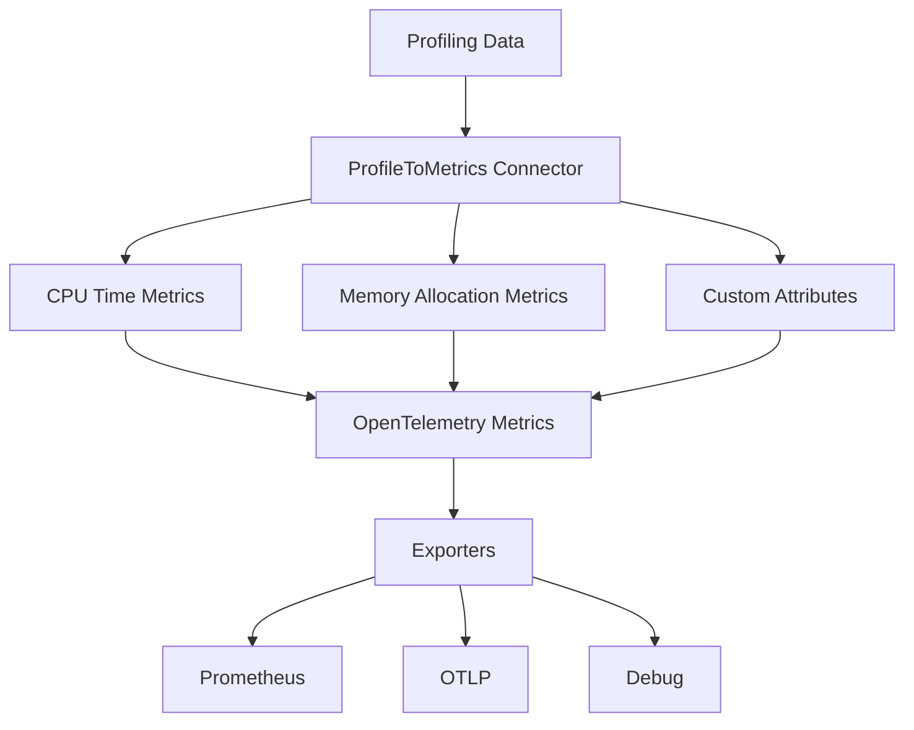

# OpenTelemetry Profile-to-Metrics Connector

[](https://github.com/henrikrexed/profiletoMetrics/actions/workflows/ci.yml)
[](https://github.com/henrikrexed/profiletoMetrics/actions/workflows/security.yml)
[](https://github.com/henrikrexed/profiletoMetrics/actions/workflows/docker.yml)
[](https://github.com/henrikrexed/profiletoMetrics/actions/workflows/oss-scorecard.yml)
[](https://henrikrexed.github.io/profiletoMetrics/)
[](https://golang.org/)
[](https://opensource.org/licenses/Apache-2.0)
[](https://opentelemetry.io/)

A powerful OpenTelemetry connector that converts profiling data into metrics, enabling you to extract valuable insights from application performance profiles.

## 📚 Documentation

**📖 [Complete Documentation](https://henrikrexed.github.io/profiletoMetrics/)** - Comprehensive guides, API reference, and deployment instructions.

## 🎯 Overview

This connector bridges the gap between profiling data and metrics, allowing you to:
- **Transform CPU profiling data** into time-series metrics
- **Convert memory allocation profiles** into allocation metrics  
- **Extract custom attributes** from profiling data using flexible rules
- **Filter and process** profiling samples based on process, thread, and pattern criteria
- **Integrate seamlessly** with existing OpenTelemetry Collector pipelines

## 🏗 Architecture



## 🚀 Features

- **CPU Time Metrics**: Extract CPU time measurements from profiling data
- **Memory Allocation Metrics**: Track memory allocation patterns
- **Flexible Attribute Extraction**: Support for literal values, regular expressions, and string table indices
- **Process Filtering**: Filter metrics by process names using regex patterns
- **Thread Filtering**: Filter samples by thread and process names
- **Pattern Filtering**: Limit metric creation based on attribute patterns
- **Docker Support**: Pre-built Docker images with configurable platforms
- **Comprehensive Testing**: Unit tests, integration tests, and example configurations

## 📋 Table of Contents

- [Installation](#installation)
- [Quick Start](#quick-start)
- [Configuration](#configuration)
- [Usage Examples](#usage-examples)
- [Docker Deployment](#docker-deployment)
- [Development](#development)
- [Testing](#testing)
- [API Reference](#api-reference)
- [Documentation](#-documentation)
- [Contributing](#contributing)

## 🛠 Installation

### Prerequisites

- Go 1.23+ (for development)
- Docker or Podman (for containerized deployment)
- Make (for build automation)

### Clone the Repository

```bash
git clone <repository-url>
cd profiletoMetrics
```

### Install Dependencies

```bash
make install-deps
```

## 🚀 Quick Start

### 1. Basic Usage

```go
package main

import (
    "context"
    "example.com/profiletoMetrics/pkg/profiletometrics"
    "go.opentelemetry.io/collector/pdata/pprofile"
)

func main() {
    // Create converter with configuration
    config := profiletometrics.Config{
        Metrics: profiletometrics.MetricsConfig{
            CPUTime: profiletometrics.MetricConfig{
                Enabled: true,
                Name:    "cpu_time_seconds",
                Description: "CPU time spent in seconds",
            },
            MemoryAllocation: profiletometrics.MetricConfig{
                Enabled: true,
                Name:    "memory_allocation_bytes",
                Description: "Memory allocated in bytes",
            },
        },
    }
    
    converter := profiletometrics.NewConverter(config)
    
    // Convert profiles to metrics
    profiles := pprofile.NewProfiles()
    // ... populate profiles with your data
    
    metrics, err := converter.ConvertProfilesToMetrics(context.Background(), profiles)
    if err != nil {
        log.Fatal(err)
    }
    
    // Use the generated metrics
    // ...
}
```

### 2. Docker Deployment

```bash
# Build the Docker image
make docker-build DOCKER_BINARY=podman DOCKER_PLATFORM=linux/amd64

# Run the collector
podman run -p 4317:4317 -p 8888:8888 hrexed/otel-collector-profilemetrics:0.1.0
```

## ⚙️ Configuration

### Core Configuration

```yaml
# examples/simple-config.yaml
receivers:
  otlp:
    protocols:
      grpc:
        endpoint: 0.0.0.0:4317
      http:
        endpoint: 0.0.0.0:4318

processors:
  batch:

exporters:
  debug:
    verbosity: detailed
  otlp:
    endpoint: http://localhost:4317

service:
  pipelines:
    traces:
      receivers: [otlp]
      processors: [batch]
      exporters: [debug, otlp]
    metrics:
      receivers: [otlp]
      processors: [batch]
      exporters: [debug, otlp]
```

### Advanced Configuration

```yaml
# examples/collector-config.yaml
receivers:
  otlp:
    protocols:
      grpc:
        endpoint: 0.0.0.0:4317
      http:
        endpoint: 0.0.0.0:4318

processors:
  batch:
    timeout: 1s
    send_batch_size: 1024
  resource:
    attributes:
      - key: service.name
        value: profile-to-metrics
        action: upsert
  k8sattributes:
    auth_type: serviceAccount
    passthrough: false
    filter:
      node_from_env_var: KUBE_NODE_NAME
  filter:
    metrics:
      exclude:
        match_type: regexp
        metric_names:
          - ".*debug.*"
  transform:
    metric_statements:
      - context: metric
        statements:
          - set(attributes["processed"], true)
  cumulativetodelta:

exporters:
  debug:
    verbosity: detailed
  otlp:
    endpoint: http://localhost:4317
  prometheus:
    endpoint: "0.0.0.0:8889"
    namespace: "profile_metrics"
    const_labels:
      service: "profile-to-metrics"

service:
  pipelines:
    traces:
      receivers: [otlp]
      processors: [batch, resource, k8sattributes, filter, transform]
      exporters: [debug, otlp]
    metrics:
      receivers: [otlp]
      processors: [batch, resource, k8sattributes, filter, transform, cumulativetodelta]
      exporters: [debug, otlp, prometheus]
```

## 📖 Usage Examples

### 1. Basic CPU and Memory Metrics

```go
config := profiletometrics.Config{
    Metrics: profiletometrics.MetricsConfig{
        CPUTime: profiletometrics.MetricConfig{
            Enabled: true,
            Name: "cpu_time_seconds",
            Description: "CPU time spent in seconds",
        },
        MemoryAllocation: profiletometrics.MetricConfig{
            Enabled: true,
            Name: "memory_allocation_bytes", 
            Description: "Memory allocated in bytes",
        },
    },
}
```

### 2. Attribute Extraction

```go
config := profiletometrics.Config{
    AttributeExtraction: profiletometrics.AttributeExtractionConfig{
        Rules: []profiletometrics.AttributeRule{
            {
                Name: "service_name",
                Source: "string_table",
                StringTableIndex: 0,
            },
            {
                Name: "pod_name", 
                Source: "regex",
                Pattern: "pod-(.*)",
                StringTableIndex: 1,
            },
        },
    },
}
```

### 3. Process Filtering

```go
config := profiletometrics.Config{
    ProcessFilter: profiletometrics.ProcessFilterConfig{
        Enabled: true,
        ProcessNamePattern: "my-app-.*",
    },
}
```

### 4. Thread Filtering

```go
config := profiletometrics.Config{
    ThreadFilter: profiletometrics.ThreadFilterConfig{
        Enabled: true,
        ThreadNamePattern: "worker-.*",
        ProcessNamePattern: "app-.*",
    },
}
```

### 5. Pattern Filtering

```go
config := profiletometrics.Config{
    PatternFilter: profiletometrics.PatternFilterConfig{
        Enabled: true,
        AttributePatterns: []string{
            "service.name=my-service",
            "k8s.pod.name=pod-.*",
        },
    },
}
```

## 🐳 Docker Deployment

### Building Docker Images

The project includes a comprehensive Makefile for building Docker images with different configurations:

```bash
# Show available options
make help

# Configure build settings
make config DOCKER_BINARY=podman DOCKER_PLATFORM=linux/amd64

# Build Docker image
make docker-build

# Build for multiple platforms
make docker-build-multi

# Push to registry
make docker-push
```

### Configuration Options

| Variable | Default | Description |
|----------|---------|-------------|
| `DOCKER_BINARY` | `docker` | Container runtime (docker/podman) |
| `DOCKER_PLATFORM` | `linux/amd64` | Target platform |
| `DOCKER_IMAGE` | `hrexed/otel-collector-profilemetrics` | Image name |
| `DOCKER_TAG` | `0.1.0` | Image tag |
| `VERSION` | `0.1.0` | Project version |

### Running the Container

```bash
# Basic run
podman run -p 4317:4317 -p 8888:8888 hrexed/otel-collector-profilemetrics:0.1.0

# With custom configuration
podman run -p 4317:4317 -p 8888:8888 \
  -v /path/to/config.yaml:/etc/otelcol/config.yaml \
  hrexed/otel-collector-profilemetrics:0.1.0

# With environment variables
podman run -p 4317:4317 -p 8888:8888 \
  -e OTEL_EXPORTER_OTLP_ENDPOINT=http://localhost:4317 \
  hrexed/otel-collector-profilemetrics:0.1.0
```

### Docker Usage

Run the collector in a container:

```bash
# Run with default configuration
docker run -p 4317:4317 -p 8888:8888 \
  hrexed/otel-collector-profilemetrics:0.1.0

# Run with custom configuration
docker run -p 4317:4317 -p 8888:8888 \
  -v /path/to/config.yaml:/etc/otelcol/config.yaml \
  hrexed/otel-collector-profilemetrics:0.1.0
```

## 🧪 Testing

### Running Tests

```bash
# Run all tests
make test

# Run with coverage
make test-coverage

# Run specific test packages
go test -v ./pkg/profiletometrics/...

# Run integration tests
go test -v ./testdata/...
```

### Test Structure

```
testdata/
├── profile_test_data.go    # Mock profile data for testing
pkg/profiletometrics/
├── converter_test.go       # Unit tests for converter
└── converter.go           # Core converter implementation
```

### Example Test

```go
func TestConvertProfilesToMetrics(t *testing.T) {
    // Create test profile data
    profiles := testdata.CreateTestProfiles()
    
    // Create converter
    config := profiletometrics.Config{
        Metrics: profiletometrics.MetricsConfig{
            CPUTime: profiletometrics.MetricConfig{
                Enabled: true,
                Name: "cpu_time_seconds",
            },
        },
    }
    converter := profiletometrics.NewConverter(config)
    
    // Convert and verify
    metrics, err := converter.ConvertProfilesToMetrics(context.Background(), profiles)
    assert.NoError(t, err)
    assert.Equal(t, 1, metrics.ResourceMetrics().Len())
}
```

## 🔧 Development

### Project Structure

```
profiletoMetrics/
├── pkg/profiletometrics/     # Core converter library
├── examples/                 # Configuration examples
├── docker/                   # Docker configurations
├── scripts/                  # Utility scripts
├── testdata/                 # Test data and mocks
├── Makefile                  # Build automation
├── ocb-simple.yaml          # OCB configuration
└── README.md                 # This file
```

### Building from Source

```bash
# Install dependencies
make install-deps

# Run tests
make test

# Build collector
make build-collector

# Build Docker image
make docker-build
```

### Adding New Features

1. **New Metric Types**: Add to `MetricsConfig` in `pkg/profiletometrics/converter.go`
2. **New Filters**: Extend filter configurations in the config structs
3. **New Attributes**: Add to `AttributeExtractionConfig`

### Code Style

- Follow Go standard formatting (`gofmt`)
- Use meaningful variable names
- Add comprehensive tests
- Document public APIs

## 📚 API Reference

### Core Types

#### `Config`
Main configuration structure for the converter.

```go
type Config struct {
    Metrics            MetricsConfig            `mapstructure:"metrics"`
    AttributeExtraction AttributeExtractionConfig `mapstructure:"attribute_extraction"`
    ProcessFilter       ProcessFilterConfig       `mapstructure:"process_filter"`
    ThreadFilter       ThreadFilterConfig         `mapstructure:"thread_filter"`
    PatternFilter       PatternFilterConfig       `mapstructure:"pattern_filter"`
}
```

#### `MetricsConfig`
Configuration for metric generation.

```go
type MetricsConfig struct {
    CPUTime           MetricConfig `mapstructure:"cpu_time"`
    MemoryAllocation  MetricConfig `mapstructure:"memory_allocation"`
}
```

#### `MetricConfig`
Individual metric configuration.

```go
type MetricConfig struct {
    Enabled     bool   `mapstructure:"enabled"`
    Name        string `mapstructure:"name"`
    Description string `mapstructure:"description"`
}
```

### Core Functions

#### `NewConverter(config Config) *Converter`
Creates a new converter instance with the given configuration.

#### `ConvertProfilesToMetrics(ctx context.Context, profiles pprofile.Profiles) (pmetric.Metrics, error)`
Converts profiling data to metrics.

### Filtering Functions

#### `matchesProcessFilter(sample pprofile.Sample, config ProcessFilterConfig) bool`
Checks if a sample matches the process filter criteria.

#### `matchesThreadFilter(sample pprofile.Sample, config ThreadFilterConfig) bool`
Checks if a sample matches the thread filter criteria.

#### `matchesPatternFilter(attributes pcommon.Map, config PatternFilterConfig) bool`
Checks if attributes match the pattern filter criteria.

## 🤝 Contributing

1. Fork the repository
2. Create a feature branch (`git checkout -b feature/amazing-feature`)
3. Commit your changes (`git commit -m 'Add amazing feature'`)
4. Push to the branch (`git push origin feature/amazing-feature`)
5. Open a Pull Request

### Development Guidelines

- Write tests for new features
- Update documentation
- Follow the existing code style
- Ensure all tests pass

## 📚 Documentation

Comprehensive documentation is available at [https://henrikrexed.github.io/profiletoMetrics](https://henrikrexed.github.io/profiletoMetrics).

### Documentation Features

- **Getting Started**: Installation, configuration, and quick start guides
- **API Reference**: Complete API documentation with examples
- **Deployment Guides**: Docker and Kubernetes deployment instructions
- **Testing**: Unit tests, integration tests, and debugging guides
- **Development**: Architecture overview and contributing guidelines

### Building Documentation Locally

```bash
# Install dependencies
pip install -r requirements.txt

# Build documentation
mkdocs build

# Serve locally with live reload
mkdocs serve

# Deploy to GitHub Pages
mkdocs gh-deploy
```

## 📄 License

This project is licensed under the Apache License 2.0 - see the [LICENSE](LICENSE) file for details.

## 🆘 Support

- **Issues**: [GitHub Issues](https://github.com/henrikrexed/profiletoMetrics/issues)
- **Discussions**: [GitHub Discussions](https://github.com/henrikrexed/profiletoMetrics/discussions)
- **Documentation**: [https://henrikrexed.github.io/profiletoMetrics](https://henrikrexed.github.io/profiletoMetrics)

## 🙏 Acknowledgments

- OpenTelemetry community for the excellent collector framework
- Contributors who helped shape this project
- The CNCF for fostering open source observability tools