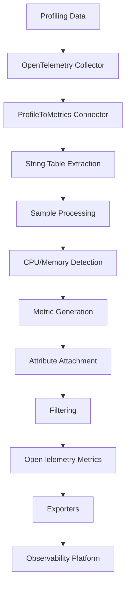
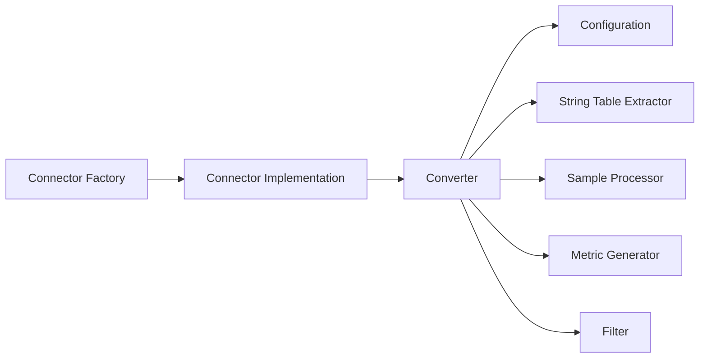
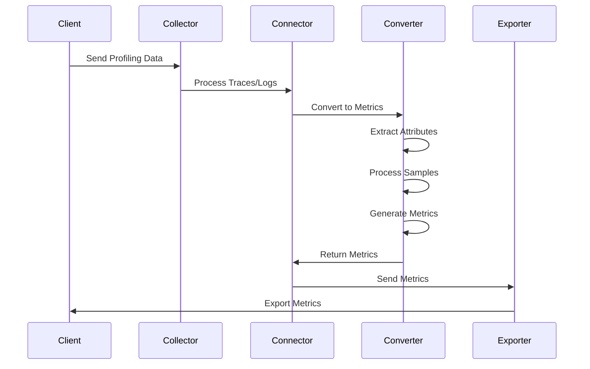
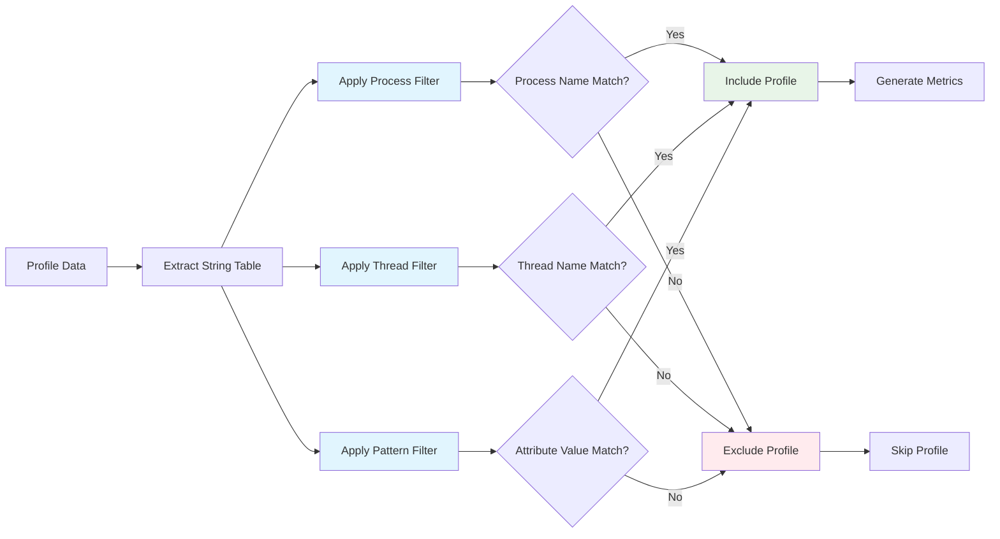

# Architecture

This document describes the architecture of the ProfileToMetrics Connector and its components.

## High-Level Architecture



## Component Architecture

### Core Components



### Data Flow



## Profile Schema and String Table Extraction

The ProfileToMetrics connector extracts attributes from the OpenTelemetry profiling data structure. Understanding the profile schema is crucial for configuring attribute extraction and filtering.

### Profile Schema Diagram

```mermaid
graph TD
    A[Profiles] --> B[ResourceProfiles]
    B --> C[Resource Attributes]
    B --> D[ScopeProfiles]
    D --> E[Scope Info]
    D --> F[Profiles Array]
    F --> G[Profile]
    G --> H[Sample Array]
    G --> I[String Table]
    G --> J[Attribute Table]
    
    I --> K[String Index 0: "main"]
    I --> L[String Index 1: "worker-1"]
    I --> M[String Index 2: "my-service"]
    I --> N[String Index 3: "production"]
    
    J --> O[Attribute Index 0: service.name → String Index 2]
    J --> P[Attribute Index 1: process.name → String Index 0]
    J --> Q[Attribute Index 2: thread.name → String Index 1]
    
    H --> R[Sample 1: CPU Time]
    H --> S[Sample 2: Memory Allocation]
    
    style I fill:#e1f5fe
    style J fill:#f3e5f5
    style K fill:#e8f5e8
    style L fill:#e8f5e8
    style M fill:#e8f5e8
    style N fill:#e8f5e8
```

### String Table Structure

The profile's string table contains all string values used throughout the profile:

- **Index 0**: `"main"` (process name)
- **Index 1**: `"worker-1"` (thread name)  
- **Index 2**: `"my-service"` (service name)
- **Index 3**: `"production"` (environment)

### Attribute Table Structure

The attribute table references string table indices:

- **service.name** → String Index 2 (`"my-service"`)
- **process.name** → String Index 0 (`"main"`)
- **thread.name** → String Index 1 (`"worker-1"`)

### Filtering Process



### Practical Filtering Example

Given the string table above, here's how filtering works with configuration:

```yaml
process_filter:
  enabled: true
  pattern: "main|worker.*"  # Matches "main" or "worker-1"

thread_filter:
  enabled: true
  pattern: "worker-.*"      # Matches "worker-1"

pattern_filter:
  enabled: true
  pattern: "my-.*"          # Matches "my-service"
```

**Result**: Only profiles with:
- Process name matching `"main|worker.*"` (matches "main")
- Thread name matching `"worker-.*"` (matches "worker-1") 
- Service name matching `"my-.*"` (matches "my-service")

Will be processed into metrics.

## Connector Architecture

### Connector Architecture

The ProfileToMetrics connector follows the standard OpenTelemetry Collector connector pattern:

1. **Factory**: Creates connector instances with default configuration
2. **Connector**: Processes incoming profiling data and converts to metrics
3. **Converter**: Core logic for profile-to-metrics transformation
4. **Configuration**: Flexible configuration for metrics, attributes, and filtering

## Converter Architecture

### Core Converter

The converter processes profiling data through several stages:

1. **Profile Extraction**: Extracts profile data from incoming traces
2. **Attribute Extraction**: Extracts attributes from the string table using regex or literal patterns
3. **Sample Processing**: Processes CPU and memory samples
4. **Metric Generation**: Creates OpenTelemetry metrics with proper attributes
5. **Filtering**: Applies process, thread, and pattern filters

### String Table Extraction

The connector extracts attributes from the profiling data's string table using:

- **Literal Values**: Direct string values for static attributes
- **Regular Expressions**: Pattern matching for dynamic attribute extraction
- **Index Access**: Direct access to string table entries by index

### Sample Processing

The connector processes different types of samples:

- **CPU Samples**: Calculates CPU time from profiling samples
- **Memory Samples**: Calculates memory allocation from profiling samples
- **Filtering**: Applies configured filters to focus on specific processes or patterns

## Configuration Architecture

### Configuration Structure

The connector configuration includes:

- **Metrics Configuration**: CPU and memory metric settings
- **Attribute Configuration**: Rules for extracting attributes from string table
- **Filter Configuration**: Process, thread, and pattern filtering options

### Configuration Validation

The connector validates:

- At least one metric type (CPU or Memory) must be enabled
- Valid regex patterns for filters
- Required attribute configurations
- Proper metric naming and units

## Filtering Architecture

### Process Filtering

Filter metrics based on process names using regex patterns:

- **Enabled**: Toggle process filtering on/off
- **Pattern**: Regex pattern to match process names
- **Examples**: `"my-app.*"`, `"(worker|scheduler).*"`

### Thread Filtering

Filter metrics based on thread names using regex patterns:

- **Enabled**: Toggle thread filtering on/off  
- **Pattern**: Regex pattern to match thread names
- **Examples**: `"worker-.*"`, `"(main|background)-.*"`

### Pattern Filtering

Filter metrics based on attribute values using regex patterns:

- **Enabled**: Toggle pattern filtering on/off
- **Pattern**: Regex pattern to match attribute values
- **Examples**: `"service-.*"`, `"(production|staging).*"`

## Metric Generation Architecture

### CPU Metrics

The connector generates CPU metrics with:

- **Metric Name**: Configurable (default: "cpu_time")
- **Unit**: Time unit (default: "ns")
- **Type**: Cumulative sum metric
- **Attributes**: Extracted from string table and resource attributes
- **Data Points**: CPU time values from profiling samples

### Memory Metrics

The connector generates memory metrics with:

- **Metric Name**: Configurable (default: "memory_allocation") 
- **Unit**: Memory unit (default: "bytes")
- **Type**: Cumulative sum metric
- **Attributes**: Extracted from string table and resource attributes
- **Data Points**: Memory allocation values from profiling samples

## Error Handling Architecture

### Error Types

The connector handles several types of errors:

- **Configuration Errors**: Invalid configuration settings
- **Data Errors**: Invalid or malformed profiling data
- **Metric Generation Errors**: Failures in metric creation
- **Filter Errors**: Invalid regex patterns in filters

### Error Handling

The connector provides comprehensive error handling:

- **Input Validation**: Validates profiling data before processing
- **Graceful Degradation**: Continues processing when possible
- **Detailed Logging**: Logs errors with context for debugging
- **Error Propagation**: Returns meaningful error messages

## Logging Architecture

### Structured Logging

The connector provides comprehensive logging:

- **Input Statistics**: Logs number of traces and samples processed
- **Processing Status**: Debug information about conversion process
- **Output Statistics**: Logs number of metrics generated
- **Error Context**: Detailed error information for troubleshooting
- **Performance Metrics**: Processing time and throughput information

## Performance Architecture

### Caching

The connector implements intelligent caching:

- **Attribute Caching**: Caches frequently accessed string table attributes
- **Pattern Caching**: Caches compiled regex patterns for filters
- **Thread-Safe**: Concurrent access with read-write locks
- **Memory Efficient**: Automatic cache cleanup and size limits

### Batch Processing

The connector supports efficient batch processing:

- **Configurable Batch Size**: Adjustable batch size for optimal performance
- **Parallel Processing**: Concurrent processing of batches
- **Memory Management**: Efficient memory usage for large datasets
- **Error Isolation**: Batch failures don't affect other batches

## Testing Architecture

### Test Structure

The connector includes comprehensive testing:

- **Unit Tests**: Individual component testing
- **Integration Tests**: End-to-end testing with real data
- **Performance Tests**: Load and stress testing
- **Configuration Tests**: Validation of all configuration options

### Test Coverage

The connector maintains high test coverage:

- **Configuration Validation**: All configuration options tested
- **Metric Generation**: CPU and memory metric generation tested
- **Filtering Logic**: All filter types and patterns tested
- **Error Handling**: Error scenarios and edge cases tested
- **Performance**: Load testing and performance benchmarks
