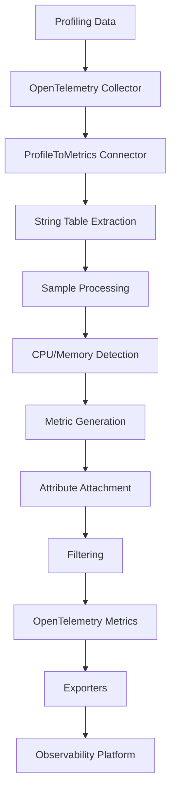
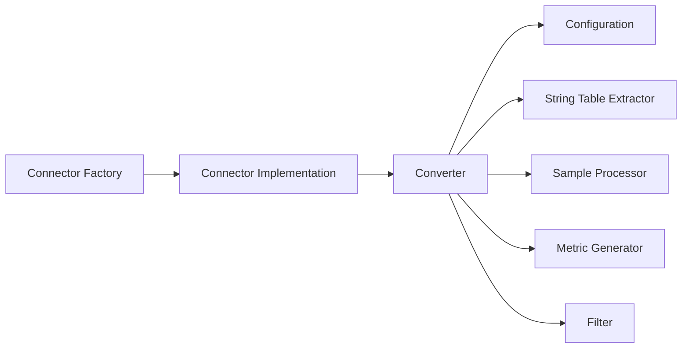
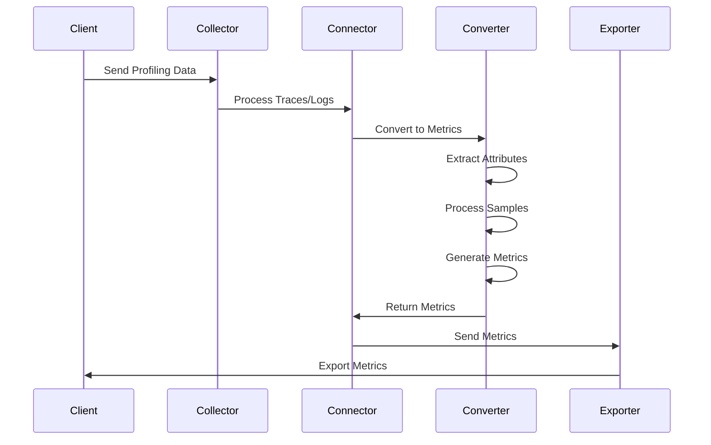

# Architecture

This document describes the architecture of the ProfileToMetrics Connector and its components.

## High-Level Architecture



## Component Architecture

### Core Components



### Data Flow



## Connector Architecture

### Factory Pattern

```go
type Factory struct {
    component.MustNewType
}

func (f *Factory) CreateDefaultConfig() component.Config {
    return &Config{
        Metrics: MetricsConfig{
            CPU: CPUMetricsConfig{Enabled: true},
            Memory: MemoryMetricsConfig{Enabled: true},
        },
    }
}

func (f *Factory) CreateConnector(
    ctx context.Context,
    params connector.CreateSettings,
    cfg component.Config,
    nextConsumer consumer.Metrics,
) (connector.Connector, error) {
    // Create connector instance
}
```

### Connector Implementation

```go
type profileToMetricsConnector struct {
    config       *Config
    nextConsumer consumer.Metrics
    logger       *zap.Logger
    converter    *profiletometrics.ConverterConnector
}

func (c *profileToMetricsConnector) Start(ctx context.Context, host component.Host) error {
    // Initialize converter
    c.converter = profiletometrics.NewConverterConnector(converterConfig)
    return nil
}

func (c *profileToMetricsConnector) ConsumeTraces(ctx context.Context, td ptrace.Traces) error {
    // Convert traces to metrics
    metrics, err := c.converter.ConvertTracesToMetrics(td)
    if err != nil {
        return err
    }
    
    // Send to next consumer
    return c.nextConsumer.ConsumeMetrics(ctx, metrics)
}
```

## Converter Architecture

### Core Converter

```go
type ConverterConnector struct {
    config ConverterConfig
    logger *zap.Logger
}

func (c *ConverterConnector) ConvertProfilesToMetrics(
    ctx context.Context,
    profiles pprofile.Profiles,
) (pmetric.Metrics, error) {
    // Extract attributes from string table
    attributes := c.extractAttributes(profiles)
    
    // Process samples
    cpuMetrics := c.processCPUSamples(profiles, attributes)
    memoryMetrics := c.processMemorySamples(profiles, attributes)
    
    // Combine metrics
    return c.combineMetrics(cpuMetrics, memoryMetrics), nil
}
```

### String Table Extraction

```go
func (c *ConverterConnector) extractAttributes(profiles pprofile.Profiles) map[string]string {
    attributes := make(map[string]string)
    
    for i := 0; i < profiles.ResourceProfiles().Len(); i++ {
        resourceProfile := profiles.ResourceProfiles().At(i)
        
        // Extract from resource attributes
        resourceProfile.Resource().Attributes().Range(func(k string, v pcommon.Value) bool {
            attributes[k] = v.AsString()
            return true
        })
        
        // Extract from string table
        for j := 0; j < resourceProfile.ScopeProfiles().Len(); j++ {
            scopeProfile := resourceProfile.ScopeProfiles().At(j)
            for k := 0; k < scopeProfile.Profiles().Len(); k++ {
                profile := scopeProfile.Profiles().At(k)
                attributes = c.extractFromStringTable(profile, attributes)
            }
        }
    }
    
    return attributes
}
```

### Sample Processing

```go
func (c *ConverterConnector) processCPUSamples(
    profiles pprofile.Profiles,
    attributes map[string]string,
) pmetric.Metrics {
    metrics := pmetric.NewMetrics()
    
    for i := 0; i < profiles.ResourceProfiles().Len(); i++ {
        resourceProfile := profiles.ResourceProfiles().At(i)
        
        for j := 0; j < resourceProfile.ScopeProfiles().Len(); j++ {
            scopeProfile := resourceProfile.ScopeProfiles().At(j)
            
            for k := 0; k < scopeProfile.Profiles().Len(); k++ {
                profile := scopeProfile.Profiles().At(k)
                
                // Process CPU samples
                cpuTime := c.calculateCPUTime(profile.Samples())
                if cpuTime > 0 {
                    c.addCPUMetric(metrics, cpuTime, attributes)
                }
            }
        }
    }
    
    return metrics
}
```

## Configuration Architecture

### Configuration Structure

```go
type Config struct {
    Metrics       MetricsConfig       `mapstructure:"metrics"`
    Attributes    []AttributeConfig   `mapstructure:"attributes"`
    ProcessFilter ProcessFilterConfig `mapstructure:"process_filter"`
    ThreadFilter  ThreadFilterConfig  `mapstructure:"thread_filter"`
    PatternFilter PatternFilterConfig  `mapstructure:"pattern_filter"`
}

type MetricsConfig struct {
    CPU    CPUMetricsConfig    `mapstructure:"cpu"`
    Memory MemoryMetricsConfig `mapstructure:"memory"`
}

type CPUMetricsConfig struct {
    Enabled     bool   `mapstructure:"enabled"`
    MetricName  string `mapstructure:"metric_name"`
    Description string `mapstructure:"description"`
    Unit        string `mapstructure:"unit"`
}
```

### Configuration Validation

```go
func (cfg *MetricsConfig) Validate() error {
    if !cfg.CPU.Enabled && !cfg.Memory.Enabled {
        return fmt.Errorf("at least one metric type must be enabled")
    }
    
    if cfg.CPU.Enabled {
        if err := cfg.CPU.Validate(); err != nil {
            return fmt.Errorf("CPU metrics configuration error: %w", err)
        }
    }
    
    if cfg.Memory.Enabled {
        if err := cfg.Memory.Validate(); err != nil {
            return fmt.Errorf("memory metrics configuration error: %w", err)
        }
    }
    
    return nil
}
```

## Filtering Architecture

### Process Filtering

```go
type ProcessFilterConfig struct {
    Enabled bool   `mapstructure:"enabled"`
    Pattern string `mapstructure:"pattern"`
    compiledPattern *regexp.Regexp
}

func (cfg *ProcessFilterConfig) Validate() error {
    if cfg.Enabled && cfg.Pattern != "" {
        var err error
        cfg.compiledPattern, err = regexp.Compile(cfg.Pattern)
        if err != nil {
            return fmt.Errorf("invalid process filter pattern: %w", err)
        }
    }
    return nil
}

func (cfg *ProcessFilterConfig) Matches(processName string) bool {
    if !cfg.Enabled || cfg.compiledPattern == nil {
        return true
    }
    return cfg.compiledPattern.MatchString(processName)
}
```

### Thread Filtering

```go
type ThreadFilterConfig struct {
    Enabled bool   `mapstructure:"enabled"`
    Pattern string `mapstructure:"pattern"`
    compiledPattern *regexp.Regexp
}

func (cfg *ThreadFilterConfig) Matches(threadName string) bool {
    if !cfg.Enabled || cfg.compiledPattern == nil {
        return true
    }
    return cfg.compiledPattern.MatchString(threadName)
}
```

### Pattern Filtering

```go
type PatternFilterConfig struct {
    Enabled bool   `mapstructure:"enabled"`
    Pattern string `mapstructure:"pattern"`
    compiledPattern *regexp.Regexp
}

func (cfg *PatternFilterConfig) Matches(attributeValue string) bool {
    if !cfg.Enabled || cfg.compiledPattern == nil {
        return true
    }
    return cfg.compiledPattern.MatchString(attributeValue)
}
```

## Metric Generation Architecture

### CPU Metrics

```go
func (c *ConverterConnector) generateCPUMetrics(
    samples []pprofile.Sample,
    attributes map[string]string,
) pmetric.Metrics {
    metrics := pmetric.NewMetrics()
    
    // Calculate CPU time
    cpuTime := c.calculateCPUTime(samples)
    if cpuTime <= 0 {
        return metrics
    }
    
    // Create metric
    resourceMetrics := metrics.ResourceMetrics()
    resourceMetric := resourceMetrics.AppendEmpty()
    
    // Set resource attributes
    resourceAttrs := resourceMetric.Resource().Attributes()
    for k, v := range attributes {
        resourceAttrs.PutStr(k, v)
    }
    
    // Create scope metrics
    scopeMetrics := resourceMetric.ScopeMetrics()
    scopeMetric := scopeMetrics.AppendEmpty()
    scopeMetric.Scope().SetName("profiletometrics")
    scopeMetric.Scope().SetVersion("0.1.0")
    
    // Create metric
    metricSlice := scopeMetric.Metrics()
    metric := metricSlice.AppendEmpty()
    metric.SetName(c.config.Metrics.CPU.MetricName)
    metric.SetDescription(c.config.Metrics.CPU.Description)
    metric.SetUnit(c.config.Metrics.CPU.Unit)
    
    // Set metric type and data
    metric.SetEmptySum()
    sum := metric.Sum()
    sum.SetIsMonotonic(true)
    sum.SetAggregationTemporality(pmetric.AggregationTemporalityCumulative)
    
    // Add data point
    dataPoints := sum.DataPoints()
    dataPoint := dataPoints.AppendEmpty()
    dataPoint.SetDoubleValue(cpuTime)
    dataPoint.SetTimestamp(pcommon.NewTimestampFromTime(time.Now()))
    
    return metrics
}
```

### Memory Metrics

```go
func (c *ConverterConnector) generateMemoryMetrics(
    samples []pprofile.Sample,
    attributes map[string]string,
) pmetric.Metrics {
    metrics := pmetric.NewMetrics()
    
    // Calculate memory allocation
    memoryAllocation := c.calculateMemoryAllocation(samples)
    if memoryAllocation <= 0 {
        return metrics
    }
    
    // Create metric similar to CPU metrics
    // ... implementation details ...
    
    return metrics
}
```

## Error Handling Architecture

### Error Types

```go
type ConversionError struct {
    Type    string
    Message string
    Cause   error
}

func (e *ConversionError) Error() string {
    return fmt.Sprintf("%s: %s", e.Type, e.Message)
}

func (e *ConversionError) Unwrap() error {
    return e.Cause
}

var (
    ErrInvalidConfiguration = &ConversionError{
        Type:    "ConfigurationError",
        Message: "invalid configuration",
    }
    
    ErrInvalidProfilingData = &ConversionError{
        Type:    "DataError",
        Message: "invalid profiling data",
    }
    
    ErrMetricGeneration = &ConversionError{
        Type:    "MetricError",
        Message: "failed to generate metrics",
    }
)
```

### Error Handling

```go
func (c *ConverterConnector) ConvertProfilesToMetrics(
    ctx context.Context,
    profiles pprofile.Profiles,
) (pmetric.Metrics, error) {
    // Validate input
    if profiles.ResourceProfiles().Len() == 0 {
        return pmetric.NewMetrics(), ErrInvalidProfilingData
    }
    
    // Process with error handling
    metrics, err := c.processProfiles(profiles)
    if err != nil {
        return pmetric.NewMetrics(), fmt.Errorf("failed to process profiles: %w", err)
    }
    
    return metrics, nil
}
```

## Logging Architecture

### Structured Logging

```go
func (c *profileToMetricsConnector) ConsumeTraces(ctx context.Context, td ptrace.Traces) error {
    // Log input statistics
    resourceSpansCount := td.ResourceSpans().Len()
    totalSpans := 0
    for i := 0; i < resourceSpansCount; i++ {
        totalSpans += td.ResourceSpans().At(i).ScopeSpans().Len()
    }
    
    c.logger.Debug("Processing traces",
        zap.Int("resource_spans_count", resourceSpansCount),
        zap.Int("total_spans", totalSpans),
    )
    
    // Process traces
    metrics, err := c.converter.ConvertTracesToMetrics(td)
    if err != nil {
        c.logger.Error("Failed to convert traces to metrics",
            zap.Error(err),
            zap.Int("input_spans", totalSpans),
        )
        return err
    }
    
    // Log output statistics
    resourceMetricsCount := metrics.ResourceMetrics().Len()
    totalMetrics := 0
    for i := 0; i < resourceMetricsCount; i++ {
        scopeMetrics := metrics.ResourceMetrics().At(i).ScopeMetrics()
        for j := 0; j < scopeMetrics.Len(); j++ {
            totalMetrics += scopeMetrics.At(j).Metrics().Len()
        }
    }
    
    c.logger.Debug("Traces converted to metrics",
        zap.Int("input_spans", totalSpans),
        zap.Int("output_resource_metrics", resourceMetricsCount),
        zap.Int("output_metrics", totalMetrics),
    )
    
    return c.nextConsumer.ConsumeMetrics(ctx, metrics)
}
```

## Performance Architecture

### Caching

```go
type ConverterConnector struct {
    config ConverterConfig
    logger *zap.Logger
    cache  map[string]interface{}
    mutex  sync.RWMutex
}

func (c *ConverterConnector) getCachedAttribute(key string) (string, bool) {
    c.mutex.RLock()
    defer c.mutex.RUnlock()
    
    value, exists := c.cache[key]
    if !exists {
        return "", false
    }
    
    strValue, ok := value.(string)
    return strValue, ok
}

func (c *ConverterConnector) setCachedAttribute(key, value string) {
    c.mutex.Lock()
    defer c.mutex.Unlock()
    
    c.cache[key] = value
}
```

### Batch Processing

```go
func (c *ConverterConnector) processBatch(
    profiles []pprofile.Profiles,
    batchSize int,
) ([]pmetric.Metrics, error) {
    var results []pmetric.Metrics
    
    for i := 0; i < len(profiles); i += batchSize {
        end := i + batchSize
        if end > len(profiles) {
            end = len(profiles)
        }
        
        batch := profiles[i:end]
        batchResults, err := c.processBatch(batch)
        if err != nil {
            return nil, err
        }
        
        results = append(results, batchResults...)
    }
    
    return results, nil
}
```

## Testing Architecture

### Test Structure

```
tests/
├── unit/
│   ├── converter_test.go
│   ├── config_test.go
│   └── connector_test.go
├── integration/
│   ├── end_to_end_test.go
│   └── performance_test.go
└── testdata/
    ├── profile_test_data.go
    └── config_test_data.go
```

### Test Utilities

```go
func createTestConverter(t *testing.T, config ConverterConfig) *ConverterConnector {
    t.Helper()
    
    logger, _ := zap.NewDevelopment()
    return &ConverterConnector{
        config: config,
        logger: logger,
    }
}

func assertMetricsEqual(t *testing.T, expected, actual pmetric.Metrics) {
    t.Helper()
    
    // Compare metrics structure and values
    assert.Equal(t, expected.ResourceMetrics().Len(), actual.ResourceMetrics().Len())
    
    for i := 0; i < expected.ResourceMetrics().Len(); i++ {
        expectedRM := expected.ResourceMetrics().At(i)
        actualRM := actual.ResourceMetrics().At(i)
        
        assert.Equal(t, expectedRM.ScopeMetrics().Len(), actualRM.ScopeMetrics().Len())
    }
}
```
