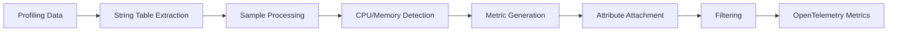

# Overview

The ProfileToMetrics Connector is an OpenTelemetry Collector connector that transforms profiling data into metrics. It's designed to be generic and configurable, allowing users to extract meaningful metrics from profiling data.

## What is Profiling Data?

Profiling data contains information about program execution, including:

- **CPU Time**: How much CPU time is spent in different functions
- **Memory Allocation**: How much memory is allocated by different parts of the code
- **Call Stacks**: The sequence of function calls that led to a particular sample
- **Metadata**: Additional information like process names, thread names, and custom attributes

## How the Connector Works

### 1. **String Table Extraction**
The connector extracts attributes from the profiling data's string table using:
- **Literal values**: Exact string matches
- **Regular expressions**: Pattern-based extraction

### 2. **Sample Processing**
Each sample in the profiling data is processed to:
- Identify the sample type (CPU or Memory)
- Extract relevant metrics
- Apply filtering rules

### 3. **Metric Generation**
The connector generates two types of metrics:
- **CPU Time Metrics**: Based on CPU profiling samples
- **Memory Allocation Metrics**: Based on memory profiling samples

### 4. **Attribute Attachment**
Custom attributes are attached to metrics based on:
- String table values
- Process and thread information
- User-defined extraction rules

### 5. **Filtering**
Multiple levels of filtering are available:
- **Process Filtering**: Filter by process name patterns
- **Thread Filtering**: Filter by thread name patterns
- **Pattern Filtering**: Filter by attribute patterns

## Supported Profiling Formats

The connector is designed to work with OpenTelemetry profiling data format, which includes:

- **CPU Profiling**: Function-level CPU time measurements
- **Memory Profiling**: Allocation and deallocation tracking
- **Custom Profiling**: User-defined profiling data

## Use Cases

### Performance Monitoring
- Track CPU usage by function
- Monitor memory allocation patterns
- Identify performance bottlenecks

### Resource Optimization
- Optimize CPU-intensive operations
- Reduce memory allocations
- Improve application efficiency

### Observability
- Integrate profiling data with metrics
- Create dashboards and alerts
- Correlate performance with business metrics

## Benefits

- **Generic Design**: Works with any profiling data format
- **Configurable**: Highly customizable attribute extraction
- **Filterable**: Multiple filtering options for precise control
- **Observable**: Full integration with OpenTelemetry ecosystem
- **Scalable**: Designed for high-throughput environments
