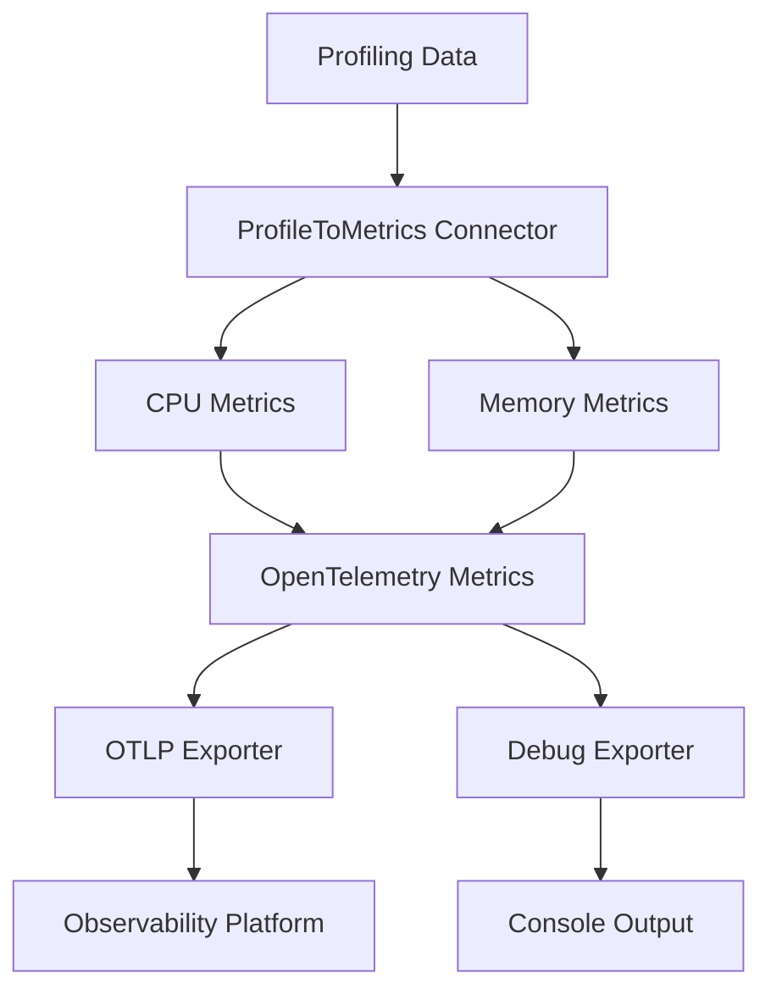

# ProfileToMetrics Connector

<div class="grid cards" markdown>

-   :material-cpu-64-bit:{ .lg .middle } **CPU Metrics**

    ---

    Convert CPU profiling data into OpenTelemetry metrics for performance monitoring

    [:octicons-arrow-right-24: CPU Metrics](configuration/connector-config.md#cpu-metrics)

-   :material-memory:{ .lg .middle } **Memory Metrics**

    ---

    Transform memory allocation profiles into actionable metrics

    [:octicons-arrow-right-24: Memory Metrics](configuration/connector-config.md#memory-metrics)

-   :material-filter:{ .lg .middle } **Advanced Filtering**

    ---

    Filter by process, thread, and pattern matching for precise metric generation

    [:octicons-arrow-right-24: Filtering](configuration/connector-config.md#filtering)

-   :material-docker:{ .lg .middle } **Easy Deployment**

    ---

    Deploy with Docker or Kubernetes using provided manifests

    [:octicons-arrow-right-24: Deployment](deployment/docker.md)

</div>

## Overview

The **ProfileToMetrics Connector** is an OpenTelemetry Collector connector that converts profiling data into metrics. It's designed to be generic and configurable, allowing users to define the types of attributes to attach to metrics and extract data from the profiling string table using literal values or regular expressions.

### Key Features

- **🔄 Generic Profile Processing**: Convert any profiling data format into OpenTelemetry metrics
- **⚡ CPU & Memory Metrics**: Generate CPU time and memory allocation metrics
- **🎯 Flexible Filtering**: Filter by process, thread, and pattern matching
- **🏷️ Attribute Extraction**: Extract attributes from string table using regex or literals
- **🐳 Docker Ready**: Pre-built Docker images with multi-platform support
- **☸️ Kubernetes Native**: Complete K8s deployment manifests
- **🔍 Debug Logging**: Comprehensive debug logging for troubleshooting
- **🧪 Test Coverage**: Unit and integration tests included

### Architecture



## Quick Start

### 1. Using Docker

```bash
# Pull the image
docker pull hrexed/otel-collector-profilemetrics:latest

# Run with configuration
docker run -p 4317:4317 -p 8888:8888 \
  -v $(pwd)/config.yaml:/etc/otelcol/config.yaml \
  hrexed/otel-collector-profilemetrics:latest
```

### 2. Using Kubernetes

```bash
# Apply the manifests
kubectl apply -f k8s/namespace.yaml
kubectl apply -f k8s/rbac.yaml
kubectl apply -f k8s/configmap.yaml
kubectl apply -f k8s/deployment.yaml
kubectl apply -f k8s/service.yaml
```

### 3. Configuration Example

```yaml
receivers:
  otlp:
    protocols:
      grpc:
        endpoint: 0.0.0.0:4317

connectors:
  profiletometrics:
    metrics:
      cpu:
        enabled: true
        metric_name: "cpu_time"
      memory:
        enabled: true
        metric_name: "memory_allocation"
    attributes:
      - key: "service.name"
        value: "my-service"
    process_filter:
      enabled: true
      pattern: "my-app.*"

exporters:
  debug:
    verbosity: detailed
  otlp:
    endpoint: "http://observability-platform:4317"

service:
  pipelines:
    traces:
      receivers: [otlp]
      connectors: [profiletometrics]
    metrics:
      receivers: [profiletometrics]
      exporters: [debug, otlp]
```

## Documentation Structure

- **[Getting Started](getting-started/overview.md)** - Overview, installation, and quick start
- **[Configuration](configuration/connector-config.md)** - Detailed configuration options
- **[Deployment](deployment/docker.md)** - Docker and Kubernetes deployment
- **[Testing](testing/unit-tests.md)** - Testing strategies and examples
- **[Development](development/architecture.md)** - Architecture and contributing guide
- **[API Reference](api/connector-api.md)** - Complete API documentation

## Support

- **Issues**: [GitHub Issues](https://github.com/henrikrexed/profiletoMetrics/issues)
- **Discussions**: [GitHub Discussions](https://github.com/henrikrexed/profiletoMetrics/discussions)
- **Documentation**: This site

## License

This project is licensed under the Apache License 2.0 - see the [LICENSE](https://github.com/henrikrexed/profiletoMetrics/blob/main/LICENSE) file for details.
